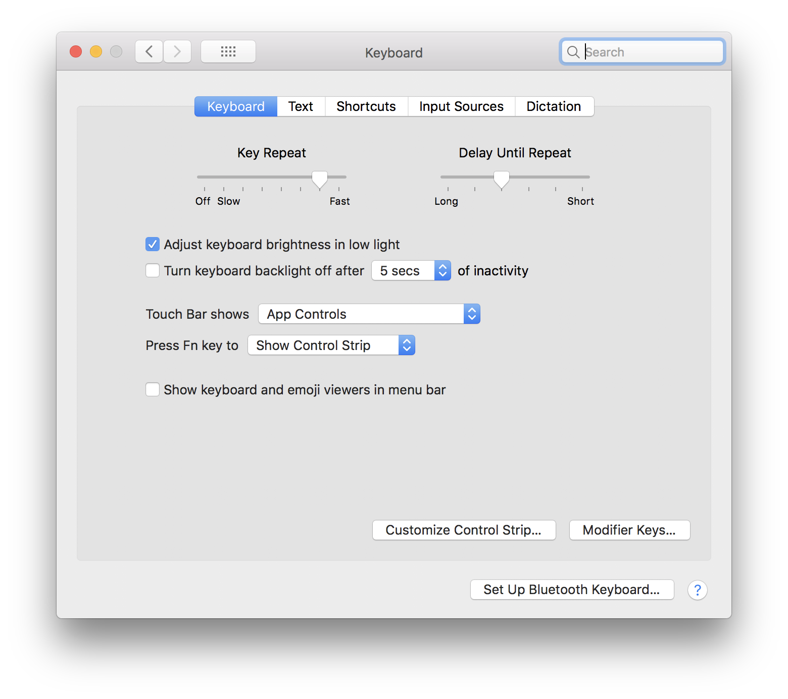
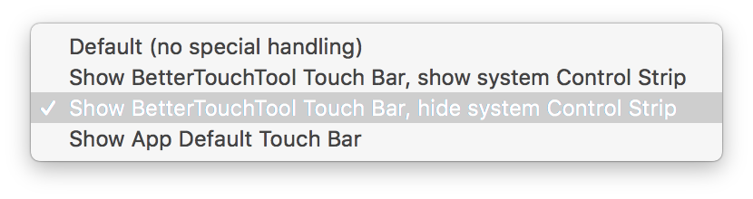
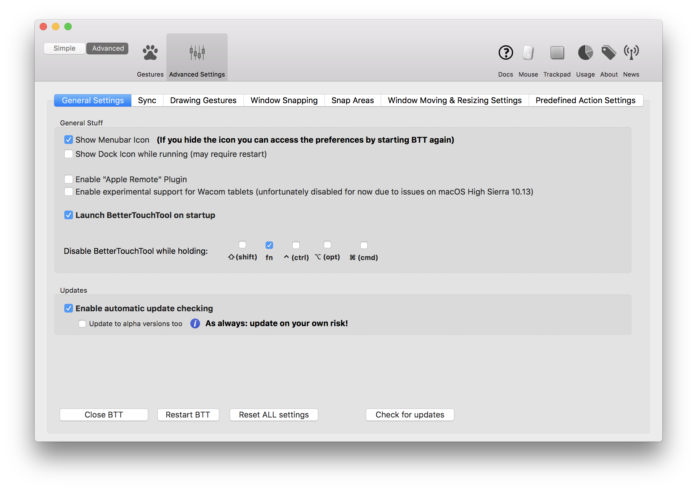
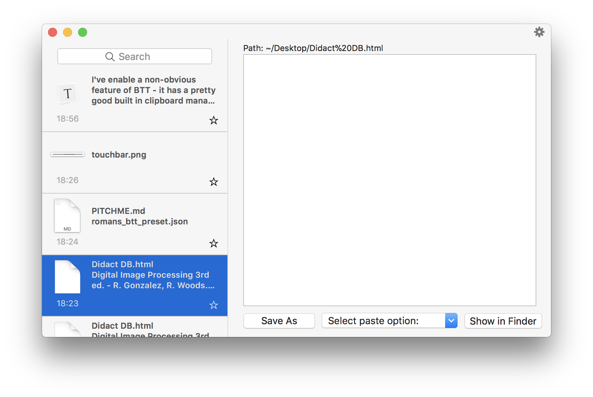

# Better Touch Tool Intellij IDE Touchbar Preset

This preset has pretty good usability for Intellij IDE users whom write on touchbar Mac. 

The customization itself is nothing special


There are a few non-obvious trick that improve usability: 

1. I've set the macOS control strip to be hidden for each IDE - this removes the ```(X) ``` button from the left side of the our custom btt touchbar . Moreover, this frees up the space taken by the control strip.

   

2. I've set the preferences to show the expaned control strip when the ``` fn ``` key is pressed, I've then set  BTT to disable when the fn key is preseed - thus we both have a full width custom touchbar AND the macOS control strip is still available when required.   

3. I've enable a non-obvious feature of BTT - it has a pretty good built in clipboard manager! I've assigned it to the keyboard shortcut ``` ⇧ + ⌘ + V ``` to display it. 

   

   ​
